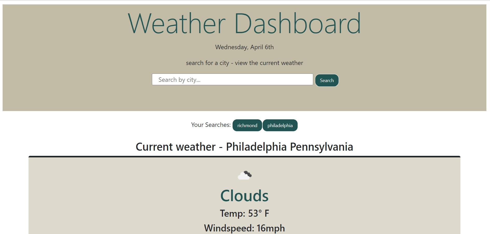

# weather-dashboard

## Purpose
This site is geared towards traverlers and tourists alike that want to view key weather data in multiple cities. On this site, the user is able to search a city by name and obtain the high and low temperatures for the current day + a 5-day forecast, a color-coded UV index, Humidity percentage, and the windspeed. If they choose to visit said place, they will be prepared for the weather to come!  

## Built with
-HTML
-CSS 
-JavaScript
-Openweather API 
-Bootstrap 
-Moment.js
-jQuery
-Google API

## Website

</img>

https://cannonel.github.io/weather-dashboard/
